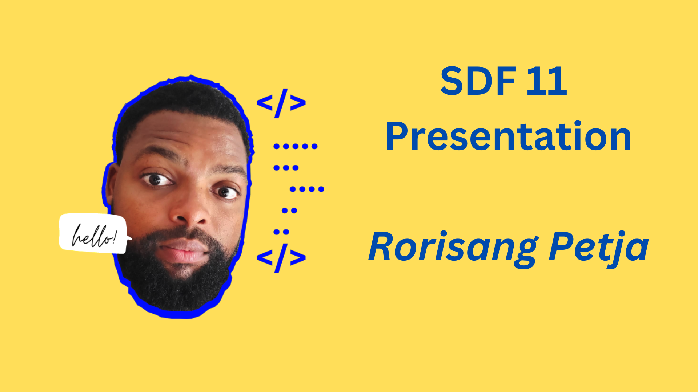
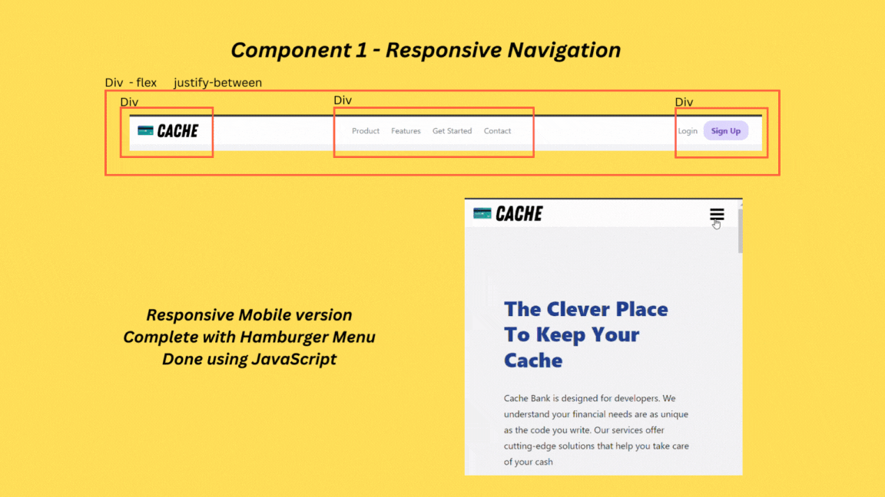
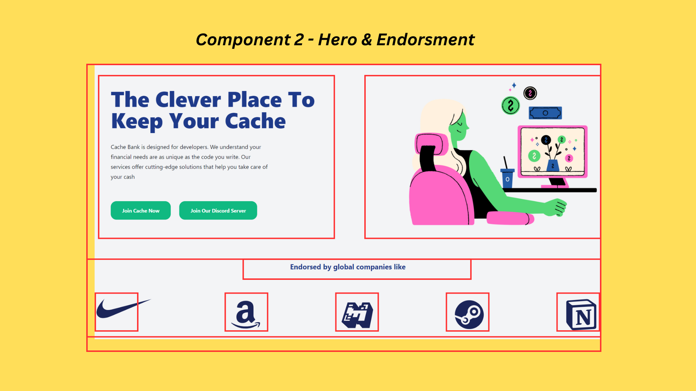
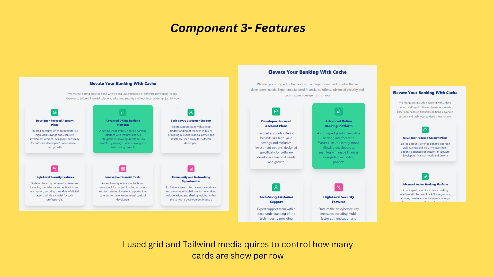
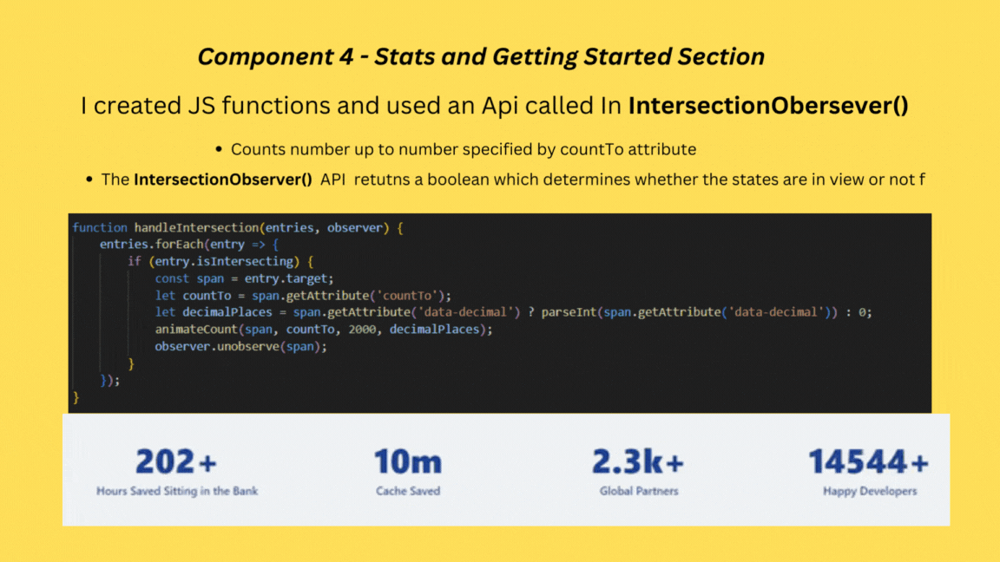
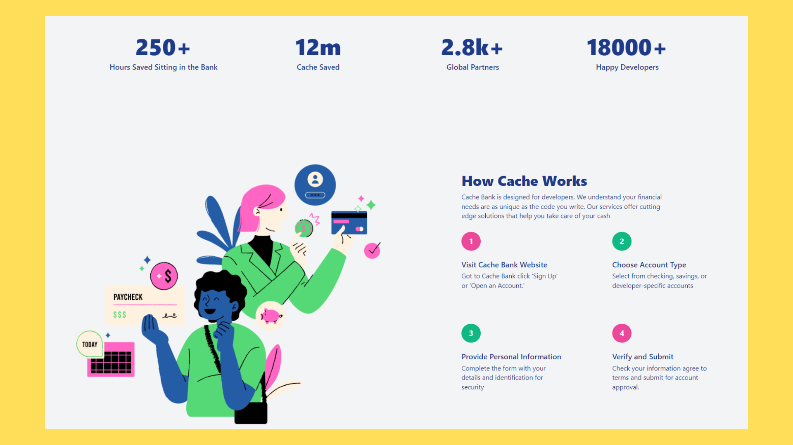
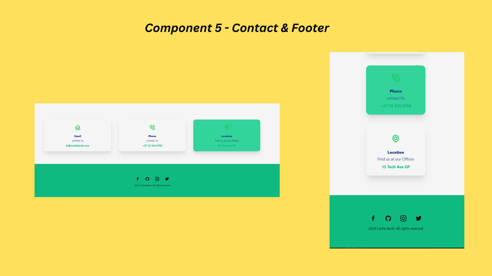

# SDF11 Portfolio Piece

## Project Overview
For this project, I was entrusted with developing a landing page using Tailwind CSS, based on a pre-designed layout. This experience not only allowed me to execute a given design with precision but also deepened my proficiency with Tailwind. Through this project, I honed my ability to translate visual concepts into responsive, scalable code, further solidifying my expertise in modern CSS frameworks.

## Loom Video link
https://www.loom.com/share/fd0a3e8492fe47a29a827a6d0c52335a?sid=c393dfeb-e5c0-447d-87ae-fafd150c2187

# Presentation Slides

## Introdunction

## Component 1

## Component 2

## Component 3

## Component 4

## Component 5

